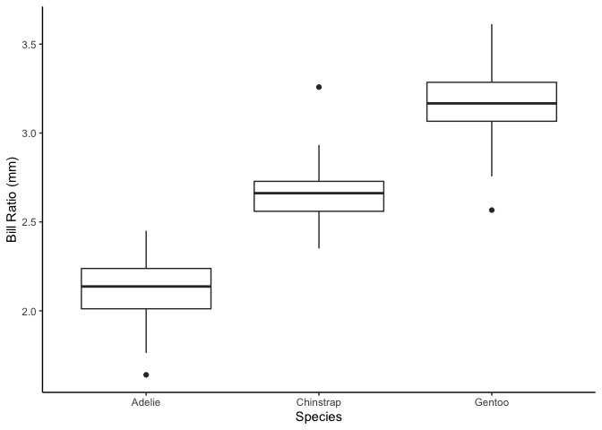
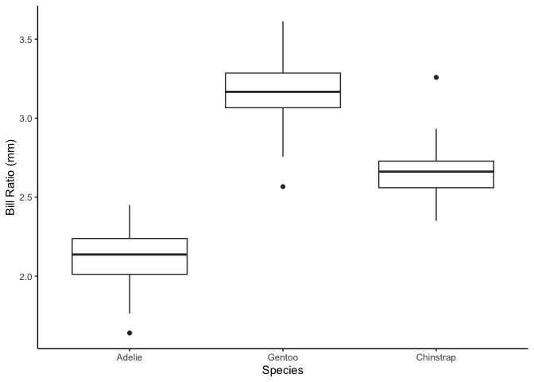
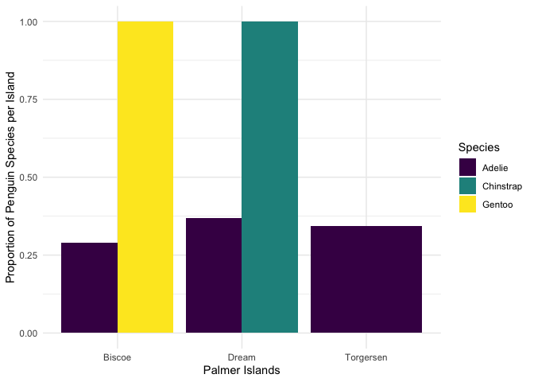

Summarizing Penguins
================
Juan Ramirez JR

## Create new variables with `mutate()`

Use `mutate()` to add a new column, while keeping the existing columns.
The general structure is:

``` r
df %>%
  mutate(new_column_name = what_it_contains)
```

For example, if I had a data frame df with columns A and B, I can add a
new column C that is the sum of A and B as follows (note: you can also
use sum(A,B) here instead of A + B):

``` r
df %>%
  mutate(C = A + B)
```

For example, we can convert body mass to kilograms:

``` r
penguins %>%
  mutate(body_mass_kg = body_mass_g / 1000)
```

    # A tibble: 344 × 9
       species island    bill_length_mm bill_depth_mm flipper_length_mm body_mass_g
       <fct>   <fct>              <dbl>         <dbl>             <int>       <int>
     1 Adelie  Torgersen           39.1          18.7               181        3750
     2 Adelie  Torgersen           39.5          17.4               186        3800
     3 Adelie  Torgersen           40.3          18                 195        3250
     4 Adelie  Torgersen           NA            NA                  NA          NA
     5 Adelie  Torgersen           36.7          19.3               193        3450
     6 Adelie  Torgersen           39.3          20.6               190        3650
     7 Adelie  Torgersen           38.9          17.8               181        3625
     8 Adelie  Torgersen           39.2          19.6               195        4675
     9 Adelie  Torgersen           34.1          18.1               193        3475
    10 Adelie  Torgersen           42            20.2               190        4250
    # … with 334 more rows, and 3 more variables: sex <fct>, year <int>,
    #   body_mass_kg <dbl>

Notice that for some variables we have `NA` listed for missing values.
We can use `drop_na()` to remove the missing values from those variables

``` r
penguins %>% 
  drop_na() #if we leave it blank it will remove any row with an NA
```

    # A tibble: 333 × 8
       species island    bill_length_mm bill_depth_mm flipper_length_mm body_mass_g
       <fct>   <fct>              <dbl>         <dbl>             <int>       <int>
     1 Adelie  Torgersen           39.1          18.7               181        3750
     2 Adelie  Torgersen           39.5          17.4               186        3800
     3 Adelie  Torgersen           40.3          18                 195        3250
     4 Adelie  Torgersen           36.7          19.3               193        3450
     5 Adelie  Torgersen           39.3          20.6               190        3650
     6 Adelie  Torgersen           38.9          17.8               181        3625
     7 Adelie  Torgersen           39.2          19.6               195        4675
     8 Adelie  Torgersen           41.1          17.6               182        3200
     9 Adelie  Torgersen           38.6          21.2               191        3800
    10 Adelie  Torgersen           34.6          21.1               198        4400
    # … with 323 more rows, and 2 more variables: sex <fct>, year <int>

``` r
penguins %>% 
  drop_na(sex) #adding a variable, removes rows with NA just for that variable
```

    # A tibble: 333 × 8
       species island    bill_length_mm bill_depth_mm flipper_length_mm body_mass_g
       <fct>   <fct>              <dbl>         <dbl>             <int>       <int>
     1 Adelie  Torgersen           39.1          18.7               181        3750
     2 Adelie  Torgersen           39.5          17.4               186        3800
     3 Adelie  Torgersen           40.3          18                 195        3250
     4 Adelie  Torgersen           36.7          19.3               193        3450
     5 Adelie  Torgersen           39.3          20.6               190        3650
     6 Adelie  Torgersen           38.9          17.8               181        3625
     7 Adelie  Torgersen           39.2          19.6               195        4675
     8 Adelie  Torgersen           41.1          17.6               182        3200
     9 Adelie  Torgersen           38.6          21.2               191        3800
    10 Adelie  Torgersen           34.6          21.1               198        4400
    # … with 323 more rows, and 2 more variables: sex <fct>, year <int>

### Evaluating the Bill Size

Create new variable called `bill_ratio` that is the ratio of length to
depth (length/depth)

``` r
penguins %>% 
  mutate(bill_ratio = bill_length_mm/bill_depth_mm)
```

    # A tibble: 344 × 9
       species island    bill_length_mm bill_depth_mm flipper_length_mm body_mass_g
       <fct>   <fct>              <dbl>         <dbl>             <int>       <int>
     1 Adelie  Torgersen           39.1          18.7               181        3750
     2 Adelie  Torgersen           39.5          17.4               186        3800
     3 Adelie  Torgersen           40.3          18                 195        3250
     4 Adelie  Torgersen           NA            NA                  NA          NA
     5 Adelie  Torgersen           36.7          19.3               193        3450
     6 Adelie  Torgersen           39.3          20.6               190        3650
     7 Adelie  Torgersen           38.9          17.8               181        3625
     8 Adelie  Torgersen           39.2          19.6               195        4675
     9 Adelie  Torgersen           34.1          18.1               193        3475
    10 Adelie  Torgersen           42            20.2               190        4250
    # … with 334 more rows, and 3 more variables: sex <fct>, year <int>,
    #   bill_ratio <dbl>

Now create a boxplot of `bill_ratio` split by species. Be sure to add
labels to the axes. You can add other modifications if you want as well
(fill/color, theme, etc).

``` r
penguins %>% 
  mutate(bill_ratio = bill_length_mm/bill_depth_mm) %>% 
  ggplot() +
  geom_boxplot(aes(x = species, y = bill_ratio, fill = bill_ratio)) +
  labs(x = "Species", y = "Bill Ratio (mm)") +  
  theme_classic()
```

    Warning: Removed 2 rows containing non-finite values (stat_boxplot).

<!-- -->

Add three new columns to penguins within one `mutate()` function: one
column that contains the bill ratio (bill length / bill depth), one that
contains the body mass converted to kg, and one that contains the
flipper length converted to meters.

``` r
penguins %>%
  mutate(bill_ratio = bill_length_mm/bill_depth_mm,
         body_mass_kg = body_mass_g/1000,
         flipper_length_m = flipper_length_mm/1000)
```

    # A tibble: 344 × 11
       species island    bill_length_mm bill_depth_mm flipper_length_mm body_mass_g
       <fct>   <fct>              <dbl>         <dbl>             <int>       <int>
     1 Adelie  Torgersen           39.1          18.7               181        3750
     2 Adelie  Torgersen           39.5          17.4               186        3800
     3 Adelie  Torgersen           40.3          18                 195        3250
     4 Adelie  Torgersen           NA            NA                  NA          NA
     5 Adelie  Torgersen           36.7          19.3               193        3450
     6 Adelie  Torgersen           39.3          20.6               190        3650
     7 Adelie  Torgersen           38.9          17.8               181        3625
     8 Adelie  Torgersen           39.2          19.6               195        4675
     9 Adelie  Torgersen           34.1          18.1               193        3475
    10 Adelie  Torgersen           42            20.2               190        4250
    # … with 334 more rows, and 5 more variables: sex <fct>, year <int>,
    #   bill_ratio <dbl>, body_mass_kg <dbl>, flipper_length_m <dbl>

We can also use `mutate()` to modify an existing variable. By default, R
reports factors in alphabetical order (you may notice in your boxplot
they always print in the same order, Adelie, Chinstrap, Gentoo). If we
want to reorder, we can use a function `fct_relevel()` from the
`forcats` package, which we will learn about in a few weeks. Modify the
code below to calculate the `bill_ratio` and then recreate the boxplot
from above by species - how does it differ?

``` r
penguins %>% 
  mutate(species = 
           fct_relevel(species, "Adelie", "Gentoo", "Chinstrap"),
         bill_ratio = bill_length_mm/bill_depth_mm) %>% 
  ggplot() +
  geom_boxplot(aes(x = species, y = bill_ratio, fill = bill_ratio)) +
  labs(x = "Species", y = "Bill Ratio (mm)") +  
  theme_classic()
```

    Warning: Removed 2 rows containing non-finite values (stat_boxplot).

<!-- -->

``` r
#This changes the order in which the species appear on the x axis.
```

## Summarize data using `group_by()` and `summarize()`

Use the combination of `group_by()` and `summarize()` to find find
summary statistics for different groups, and put them in a nice table.

`group_by()` “takes an existing table and converts it into a grouped
table where operations are performed ‘by group’”

`summarize()` “creates a new data frame. It will have one (or more) rows
for each combination of grouping variables; if there are no grouping
variables, the output will have a single row summarizing all
observations in the input. It will contain one column for each grouping
variable and one column for each of the summary statistics that you have
specified”

For example, we can calculate the mean and standard deviation for body
mass:

``` r
penguins %>%
  group_by(species) %>%
  summarize(mass_mean = mean(body_mass_g, na.rm = TRUE),
            mass_sd = sd(body_mass_g, na.rm = TRUE))
```

    # A tibble: 3 × 3
      species   mass_mean mass_sd
      <fct>         <dbl>   <dbl>
    1 Adelie        3701.    459.
    2 Chinstrap     3733.    384.
    3 Gentoo        5076.    504.

Note, that `na.rm = TRUE` removes NA from the calculations instead of
removing them from the data like `drop_na()`. Often, errors reported
with `mean()` and similar functions are because there are `NA` in the
data.

Second Note, if you use `mosaic` in your statistics class, note that
`mean()` used here is from base R, so there is no `~` in front of the
variable. If you wanted to use `mosaic` you can, you will just need to
modify the syntax:

-   Base R: `mean(x)`  
-   Mosaic: `mean(~x)`

### Group by Species and Sex

Find the mean and standard deviation of body mass in *kilograms* by
species and sex.

``` r
penguins %>% 
  mutate(body_mass_kg = body_mass_g/1000) %>% 
  group_by(species, sex) %>% 
  summarize(mass_sd = sd(body_mass_kg, na.rm = TRUE))
```

    `summarise()` has grouped output by 'species'. You can override using the
    `.groups` argument.

    # A tibble: 8 × 3
    # Groups:   species [3]
      species   sex    mass_sd
      <fct>     <fct>    <dbl>
    1 Adelie    female   0.269
    2 Adelie    male     0.347
    3 Adelie    <NA>     0.477
    4 Chinstrap female   0.285
    5 Chinstrap male     0.362
    6 Gentoo    female   0.282
    7 Gentoo    male     0.313
    8 Gentoo    <NA>     0.338

Starting with penguins, create a summary table containing the maximum
and minimum length of flippers (call the columns flip_max and flip_min)
for just Chinstrap penguins, grouped by island. (Hint - remember
`filter()`)

``` r
penguins %>% 
  filter(species == "Chinstrap") %>% 
  mutate(flip_min = min(flipper_length_mm, na.rm = TRUE), flip_max = max(flipper_length_mm, na.rm = TRUE)) %>% 
  select(island, flip_min, flip_max) %>% 
  arrange(island)
```

    # A tibble: 68 × 3
       island flip_min flip_max
       <fct>     <int>    <int>
     1 Dream       178      212
     2 Dream       178      212
     3 Dream       178      212
     4 Dream       178      212
     5 Dream       178      212
     6 Dream       178      212
     7 Dream       178      212
     8 Dream       178      212
     9 Dream       178      212
    10 Dream       178      212
    # … with 58 more rows

Starting with penguins, in a piped sequence:

-   Add a new column called bill_ratio that is the ratio of bill length
    to bill depth (hint: mutate())  
-   Only keep columns species and bill_ratio  
-   Group the data by species  
-   Create a summary table containing the mean of the bill_ratio
    variable, by species (name the column in the summary table
    bill_ratio_mean)

``` r
penguins %>% 
  mutate(bill_ratio = bill_length_mm/bill_depth_mm) %>% 
  select(species, bill_ratio) %>% 
  arrange(species) %>% 
  mutate(bill_ratio_mean = mean(bill_ratio, na.rm = TRUE)) 
```

    # A tibble: 344 × 3
       species bill_ratio bill_ratio_mean
       <fct>        <dbl>           <dbl>
     1 Adelie        2.09            2.61
     2 Adelie        2.27            2.61
     3 Adelie        2.24            2.61
     4 Adelie       NA               2.61
     5 Adelie        1.90            2.61
     6 Adelie        1.91            2.61
     7 Adelie        2.19            2.61
     8 Adelie        2               2.61
     9 Adelie        1.88            2.61
    10 Adelie        2.08            2.61
    # … with 334 more rows

## New function `across()`

The `across()` function is especially useful within `summarize()` to
efficiently create summary tables with one or more functions applied to
multiple variables (columns).

Let’s compare two ways of doing the same thing: creating a summary table
of mean values for all penguin size measurements ending in “mm” (bill
depth, bill length, flipper length), by species.

Approach 1:

``` r
penguins %>%
  group_by(species) %>%
  summarize(bill_length_mean = mean(bill_length_mm, na.rm = TRUE),
            bill_depth_mean = mean(bill_depth_mm, na.rm = TRUE),
            flipper_length_mean = mean(flipper_length_mm, na.rm = TRUE))
```

    # A tibble: 3 × 4
      species   bill_length_mean bill_depth_mean flipper_length_mean
      <fct>                <dbl>           <dbl>               <dbl>
    1 Adelie                38.8            18.3                190.
    2 Chinstrap             48.8            18.4                196.
    3 Gentoo                47.5            15.0                217.

Approach 2:

``` r
penguins %>%
  group_by(species) %>%
  summarize(across(ends_with("mm"), mean, na.rm = TRUE))
```

    # A tibble: 3 × 4
      species   bill_length_mm bill_depth_mm flipper_length_mm
      <fct>              <dbl>         <dbl>             <dbl>
    1 Adelie              38.8          18.3              190.
    2 Chinstrap           48.8          18.4              196.
    3 Gentoo              47.5          15.0              217.

We can modify multiple names by appending something to the beginning
where {.col} will be replaced with the column name:

``` r
penguins %>%
  group_by(year) %>%
  summarise(across(starts_with("bill"), max, na.rm = TRUE, .names = "max_{.col}"))
```

    # A tibble: 3 × 3
       year max_bill_length_mm max_bill_depth_mm
      <int>              <dbl>             <dbl>
    1  2007               59.6              21.5
    2  2008               54.3              21.1
    3  2009               55.9              20.7

or ending of the column name:

``` r
penguins %>%
  group_by(year) %>%
  summarise(across(starts_with("bill"), max, na.rm = TRUE, .names = "{.col}_max"))
```

    # A tibble: 3 × 3
       year bill_length_mm_max bill_depth_mm_max
      <int>              <dbl>             <dbl>
    1  2007               59.6              21.5
    2  2008               54.3              21.1
    3  2009               55.9              20.7

Starting from penguins, create a summary table that finds the mean and
standard deviation for all variables containing the string “length”,
grouped by penguin species. Update the column names to start with
“avg\_” or “sd\_”, followed by the original column names.

There’s quite a bit happening here, so a little breakdown:

-   We use `contains("length")` to indicate we’ll apply the functions to
    any columns with the word “length” in the name  
-   Within `list()` is where the functions to be applied across columns
    are given, and where their “names” of “avg” and “stdev” are set  
-   We use `.names =` to define the final column names in the summary
    table. Here, the name should start with the function “name”
    specified above (“avg” or “stdev”), then an underscore, then the
    original column name (that’s what `"{.fn}_{.col}"` will do)

``` r
penguins %>%
  group_by(species) %>%
  summarize(across(contains("length"),
                   list(avg = mean, stdev = sd),
                   na.rm = TRUE,
                   .names = "{.fn}_{.col}"))
```

    # A tibble: 3 × 5
      species   avg_bill_length_… stdev_bill_leng… avg_flipper_len… stdev_flipper_l…
      <fct>                 <dbl>            <dbl>            <dbl>            <dbl>
    1 Adelie                 38.8             2.66             190.             6.54
    2 Chinstrap              48.8             3.34             196.             7.13
    3 Gentoo                 47.5             3.08             217.             6.48

### Practice with `across()`

Starting with penguins, group data by island then use `across()` to find
the median value of groups for any columns containing the string “mm”.

Bonus Point: The names in the resulting table should be the original
column name followed by an underscore, then the word “median”
(e.g. colname_median).

``` r
penguins %>% 
  group_by(island) %>% 
  summarise(across(contains("mm")))
```

    `summarise()` has grouped output by 'island'. You can override using the
    `.groups` argument.

    # A tibble: 344 × 4
    # Groups:   island [3]
       island bill_length_mm bill_depth_mm flipper_length_mm
       <fct>           <dbl>         <dbl>             <int>
     1 Biscoe           37.8          18.3               174
     2 Biscoe           37.7          18.7               180
     3 Biscoe           35.9          19.2               189
     4 Biscoe           38.2          18.1               185
     5 Biscoe           38.8          17.2               180
     6 Biscoe           35.3          18.9               187
     7 Biscoe           40.6          18.6               183
     8 Biscoe           40.5          17.9               187
     9 Biscoe           37.9          18.6               172
    10 Biscoe           40.5          18.9               180
    # … with 334 more rows

Starting from penguins, write a piped sequence to:

-   Exclude penguins observed on Biscoe Island  
-   Only keep variables `species` through `body_mass_g`  
-   Rename the species variable to `spp_penguin`  
-   Group the data by `spp_penguin`  
-   Find the mean value for any variable containing the string “length”,
    by penguin species, with column names updated to the original column
    name appended with “\_mean” at the end

``` r
penguins %>% 
  filter(species != "Biscoe") %>% 
  select(species:body_mass_g) %>% 
  mutate(spp_penguin = species) %>% 
  arrange(spp_penguin) %>% 
  summarise(across(contains("length"),
                   mean,
                   na.rm = TRUE,
                   .names = "{.col}_mean"))
```

    # A tibble: 1 × 2
      bill_length_mm_mean flipper_length_mm_mean
                    <dbl>                  <dbl>
    1                43.9                   201.

## New Function `count()`

The `dplyr::count()` function wraps a bunch of things into one beautiful
friendly line of code to help you find counts of observations by group.
To demonstrate what it does, let’s find the counts of penguins in the
penguins dataset by species in two different ways:

-   Using `group_by() %>% summarize()` with `n()` to count
    observations  
-   Using `count()` to do the exact same thing

``` r
penguins %>%
  group_by(species) %>%
  summarize(n = n())
```

    # A tibble: 3 × 2
      species       n
      <fct>     <int>
    1 Adelie      152
    2 Chinstrap    68
    3 Gentoo      124

``` r
penguins %>%
  count(species)
```

    # A tibble: 3 × 2
      species       n
      <fct>     <int>
    1 Adelie      152
    2 Chinstrap    68
    3 Gentoo      124

For example, what does the following code do?

``` r
penguins %>%
  count(species, year)  #groups by species and year and makes a table summarizing to a variable "n" for count
```

    # A tibble: 9 × 3
      species    year     n
      <fct>     <int> <int>
    1 Adelie     2007    50
    2 Adelie     2008    50
    3 Adelie     2009    52
    4 Chinstrap  2007    26
    5 Chinstrap  2008    18
    6 Chinstrap  2009    24
    7 Gentoo     2007    34
    8 Gentoo     2008    46
    9 Gentoo     2009    44

We can combine `count()` with `mutate()` to find proportions and the
visualize them - comment the following code:

``` r
penguins %>% 
  count(species, island) %>% #comment
  group_by(species) %>% #comment 
  mutate(total = sum(n),  #comment
         prop = n/total) %>%  #comment
  ggplot(aes(x = island, y = prop, fill = species)) + #comment
  geom_col(position = position_dodge()) + #comment
  scale_fill_viridis_d()+ #comment
  labs(x = "Palmer Islands",
       y = "Proportion of Penguin Species per Island",
       fill = "Species") +
  theme_minimal()
```

<!-- -->

### Practice with `count()`

Starting with penguins, find counts of observation by species, island,
and year.

``` r
penguins %>% 
  count(species, island, year)
```

    # A tibble: 15 × 4
       species   island     year     n
       <fct>     <fct>     <int> <int>
     1 Adelie    Biscoe     2007    10
     2 Adelie    Biscoe     2008    18
     3 Adelie    Biscoe     2009    16
     4 Adelie    Dream      2007    20
     5 Adelie    Dream      2008    16
     6 Adelie    Dream      2009    20
     7 Adelie    Torgersen  2007    20
     8 Adelie    Torgersen  2008    16
     9 Adelie    Torgersen  2009    16
    10 Chinstrap Dream      2007    26
    11 Chinstrap Dream      2008    18
    12 Chinstrap Dream      2009    24
    13 Gentoo    Biscoe     2007    34
    14 Gentoo    Biscoe     2008    46
    15 Gentoo    Biscoe     2009    44

Starting with penguins, filter to only keep Adelie and Gentoo penguins,
then find counts by species and sex.

``` r
penguins %>% 
  filter(species == "Adelie" | species == "Gentoo") %>% 
  count(species, sex)
```

    # A tibble: 6 × 3
      species sex        n
      <fct>   <fct>  <int>
    1 Adelie  female    73
    2 Adelie  male      73
    3 Adelie  <NA>       6
    4 Gentoo  female    58
    5 Gentoo  male      61
    6 Gentoo  <NA>       5

## New Function `case_when()`

The `case_when()` function is like a really friendly if-else statement.
When used within `mutate()`, it allows you to add a new column
containing values dependent on your condition(s).

To penguins, add a new column size_bin that contains:

-   “large” if body mass is greater than 4500 g  
-   “medium” if body mass is greater than 3000 g, and less than or equal
    to 4500 g  
-   “small” if body mass is less than or equal to 3000 g

``` r
penguins %>%
  mutate(size_bin = case_when(
      body_mass_g > 4500 ~ "large",
      body_mass_g > 3000 & body_mass_g <= 4500 ~ "medium",
      body_mass_g <= 3000 ~ "small"
    )
  )
```

    # A tibble: 344 × 9
       species island    bill_length_mm bill_depth_mm flipper_length_mm body_mass_g
       <fct>   <fct>              <dbl>         <dbl>             <int>       <int>
     1 Adelie  Torgersen           39.1          18.7               181        3750
     2 Adelie  Torgersen           39.5          17.4               186        3800
     3 Adelie  Torgersen           40.3          18                 195        3250
     4 Adelie  Torgersen           NA            NA                  NA          NA
     5 Adelie  Torgersen           36.7          19.3               193        3450
     6 Adelie  Torgersen           39.3          20.6               190        3650
     7 Adelie  Torgersen           38.9          17.8               181        3625
     8 Adelie  Torgersen           39.2          19.6               195        4675
     9 Adelie  Torgersen           34.1          18.1               193        3475
    10 Adelie  Torgersen           42            20.2               190        4250
    # … with 334 more rows, and 3 more variables: sex <fct>, year <int>,
    #   size_bin <chr>

### Practice with `case_when()`

Identify what is going on in this code:

``` r
penguins %>%
  select(species, year, flipper_length_mm) %>%  #Select specific columns
  rename(study_year = year) %>%   #rename "year" to "study_year"
  filter(species == "Adelie") %>%  #Only keep Adelie penguins
  mutate(flipper_rank = case_when(   #Create "flipper_rank" column
    flipper_length_mm < 200 ~ 1,   #if length is less than 200, rank as "1"
    flipper_length_mm >= 200 ~ 2,  #if length is more than or equal to 200, rank as "2"
    TRUE ~ 0 # 0 for anything else
  ))
```

    # A tibble: 152 × 4
       species study_year flipper_length_mm flipper_rank
       <fct>        <int>             <int>        <dbl>
     1 Adelie        2007               181            1
     2 Adelie        2007               186            1
     3 Adelie        2007               195            1
     4 Adelie        2007                NA            0
     5 Adelie        2007               193            1
     6 Adelie        2007               190            1
     7 Adelie        2007               181            1
     8 Adelie        2007               195            1
     9 Adelie        2007               193            1
    10 Adelie        2007               190            1
    # … with 142 more rows

Add a new column to penguins called study_year that contains:

-   “Year 1” if the year is 2007  
-   “Year 2” if the year is 2008  
-   “Year 3” if the year is 2009

``` r
penguins %>% 
  mutate(study_year = case_when(
    year == 2007 ~ "Year 1",
    year == 2008 ~ "Year 2",
    year == 2009 ~ "Year 3"
  ))
```

    # A tibble: 344 × 9
       species island    bill_length_mm bill_depth_mm flipper_length_mm body_mass_g
       <fct>   <fct>              <dbl>         <dbl>             <int>       <int>
     1 Adelie  Torgersen           39.1          18.7               181        3750
     2 Adelie  Torgersen           39.5          17.4               186        3800
     3 Adelie  Torgersen           40.3          18                 195        3250
     4 Adelie  Torgersen           NA            NA                  NA          NA
     5 Adelie  Torgersen           36.7          19.3               193        3450
     6 Adelie  Torgersen           39.3          20.6               190        3650
     7 Adelie  Torgersen           38.9          17.8               181        3625
     8 Adelie  Torgersen           39.2          19.6               195        4675
     9 Adelie  Torgersen           34.1          18.1               193        3475
    10 Adelie  Torgersen           42            20.2               190        4250
    # … with 334 more rows, and 3 more variables: sex <fct>, year <int>,
    #   study_year <chr>

Starting with penguins, only keep observations for Chinstrap penguins,
then only keep the `flipper_length_mm` and `body_mass_g` variables. Add
a new column called `fm_ratio` that contains the ratio of flipper length
to body mass for each penguin. Next, add another column named
`ratio_bin` which contains the word “high” if `fm_ratio` is greater than
or equal to 0.05, “low” if the ratio is less than 0.05, and “no record”
if anything else (e.g. NA).

``` r
penguins %>% 
  filter(species == "Chinstrap") %>% 
  select(flipper_length_mm, body_mass_g) %>% 
  mutate(fm_ratio = flipper_length_mm/body_mass_g) %>% 
  mutate(ratio_bin = case_when(
    fm_ratio >= 0.05 ~ "high",
    fm_ratio < 0.05 ~ "low",
    TRUE ~ "no record"
  ))
```

    # A tibble: 68 × 4
       flipper_length_mm body_mass_g fm_ratio ratio_bin
                   <int>       <int>    <dbl> <chr>    
     1               192        3500   0.0549 high     
     2               196        3900   0.0503 high     
     3               193        3650   0.0529 high     
     4               188        3525   0.0533 high     
     5               197        3725   0.0529 high     
     6               198        3950   0.0501 high     
     7               178        3250   0.0548 high     
     8               197        3750   0.0525 high     
     9               195        4150   0.0470 low      
    10               198        3700   0.0535 high     
    # … with 58 more rows

## Try it out

Explore a few more variables in the penguins data to create new
variables, calculate new summary statistics, and make additional graphs
as needed to answer a research question of interest:

1.  Research Question > Which sex of what penguin species has a high
    bill ratio (more than .05)?

2.  Code

``` r
penguins %>% 
  mutate(bill_ratio = bill_length_mm/bill_depth_mm) %>% 
  mutate(hits = case_when(
    bill_ratio >= 0.05 ~ "yes",
    TRUE ~ "no"
  )) %>% 
  filter(hits == "yes") %>% 
  select(species, sex, bill_ratio) %>% 
  arrange(desc(bill_ratio))
```

    # A tibble: 342 × 3
       species sex    bill_ratio
       <fct>   <fct>       <dbl>
     1 Gentoo  male         3.61
     2 Gentoo  male         3.51
     3 Gentoo  male         3.51
     4 Gentoo  female       3.49
     5 Gentoo  male         3.46
     6 Gentoo  female       3.45
     7 Gentoo  female       3.45
     8 Gentoo  female       3.44
     9 Gentoo  male         3.44
    10 Gentoo  male         3.44
    # … with 332 more rows

3.  Description of Results/Answer to Question  
    \> The male Gentoo penguin has the largest bill ratio, at 3.62

## Wrapping Up

The biggest challenge with data wrangling is figuring out what you want
to do first and then thinking about how the vocabulary translates to the
code. Once you know *what* you want to do, it is much easier to look up
*how* to do it!
